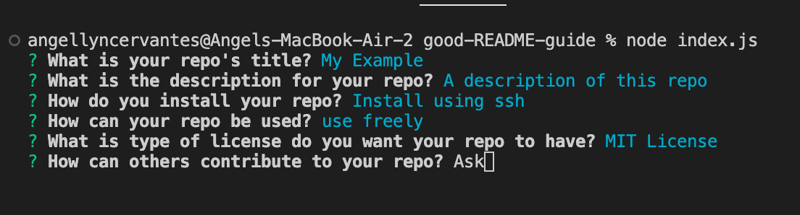

# Good README Guide

## Description

When building a project on github, a README is always required to explain the project and what it can be used for. However, it can be difficult to write a professional README file. To help create the best README possible, users can use this program. It takes user input for all of the sections required for a professional README, then generates a product containing a README.md and a LICENSE of the user's choosing. 

By creating this project, I learned to apply my knowledge of Node.js to run the program. I also learned how to use different Node Modules which my program to perform different tasks like fetching api data and inquiring user information.

## Table of Contents

- [Installation](#installation)
- [Usage](#usage)
- [Credits](#credits)
- [License](#license)
- [Badges](#badges)

## Installation

1. Click on green code button and copy the ssh link
2. Open up terminal or git bash, then navigate to where you want the repository to be placed.
3. Type out "git clone (ssh link)"

## Usage

This program requires Node.js to run. Please install before attempting the next steps.

Using the terminal, navigate to the folder that the 'index.js' file is in. Start program by typing 'node index.js'. 

This will prompt the user with a series of questions. 

Once the last question has been answered, the program will take the user's data and create a README.md and LICENSE within the 'product' folder. 

## Credits 

Github licenses API: https://docs.github.com/en/rest/licenses#about-the-licenses-api

Choosealicense: https://choosealicense.com/

## License

Please refer to LICENSE in this repository

## Badges

